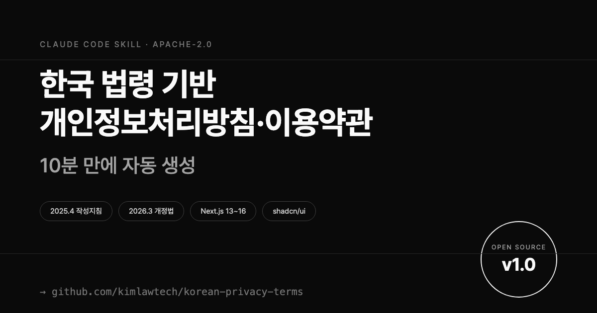

# korean-privacy-terms



[](https://opensource.org/licenses/Apache-2.0)


[](https://discord.gg/qmCbMaER)

한국 법령 기반 개인정보처리방침·이용약관 자동 생성 Claude Code 스킬.
2025.4.21 개인정보 처리방침 작성지침 및 2026.3 개정 개인정보보호법 반영.

> 한국 법률 AI 허브 **SpeciAI** 에서 만들고 있어요.
> 계약·노동·투자·지재권을 AI로 해결하는 창업자·변호사 커뮤니티에 초대합니다.
> → [discord.gg/qmCbMaER](https://discord.gg/qmCbMaER)

**라이선스**: Apache-2.0
**버전**: 2.0.0
**저자**: [@kimlawtech](https://github.com/kimlawtech)

## 특징

- **최신 법령 반영**
  - 개인정보 처리방침 작성지침 2025.4.21 개정
  - 개인정보보호법 2026.3.10 공포 (2026.9.11 시행)
  - 전송요구권 §35조의2 (2025.3.13 시행)
  - 자동화된 결정 대응권 §37조의2 (2024.3.15 시행)
  - 생성형 AI 개인정보 안내서 (2025.8)
  - 공정위 전자상거래 표준약관 제10023호
  - 전자상거래법 개정 (2025.12 국회 통과)

- **UI 컴포넌트 포함**
  - shadcn/ui 기반 동의 모달
  - 쿠키 동의 배너 (분석·광고·기능 쿠키 구분)
  - 카카오식 라벨링 카드 6종
  - 처리방침·약관 페이지 템플릿

- **서비스 유형별 분기**
  - SaaS / 쇼핑몰 / 커뮤니티 / 블로그 / 핀테크 / AI

## 설치

Claude Code 스킬 디렉토리에 배치:

```bash
cp -r korean-privacy-terms ~/.claude/skills/
```

또는 프로젝트별로:

```bash
cp -r korean-privacy-terms /your-project/.claude/skills/
```

## 사용법

Claude Code에서:

```
/privacy-terms
```

또는 자연어로:

```
"개인정보처리방침이랑 이용약관 만들어줘"
"쿠키 배너 추가해줘"
"회원가입 동의 모달 설치해줘"
```

## 대상 프로젝트

- **Next.js** 13+ (App Router 권장)
- **Tailwind CSS**
- **shadcn/ui** (자동 설치 지원)
- **MDX** (자동 설치 지원)

## 디렉토리 구조 (v2.0)

```
korean-privacy-terms/
├── SKILL.md                    # 진입점
├── ROADMAP.md                  # 장기 확장 계획 (CCPA·APPI·PIPL 등)
│
├── jurisdictions/              # 관할법별 법령·템플릿
│   ├── kr-pipa/                # 🇰🇷 한국 PIPA + 약관규제법
│   └── eu-gdpr/                # 🇪🇺 EU GDPR (v2.0 신규)
│
├── templates/                  # 한국법 기본 템플릿 (기존)
│   ├── privacy-policy.mdx.tmpl        # 한국어
│   ├── privacy-policy.en.mdx.tmpl     # 영문 병기 (v1.1.0)
│   ├── terms-of-service.mdx.tmpl      # 한국어
│   └── terms-of-service.en.mdx.tmpl   # 영문 병기 (v1.1.0)
│
├── references/                 # 한국법 레퍼런스 (10개)
├── assets/components/          # React 컴포넌트 원본
├── assets/config/              # next.config, mdx-components 템플릿
├── scripts/                    # interview, render, install 절차
└── examples/                   # 입출력 페어
```

## 법적 면책

본 스킬이 생성하는 문서는 **참고용 초안**이며, 법률 자문이 아닙니다.

- 실서비스 배포 전 **변호사 검토 필수**
- 개인정보처리방침 미공개 시 **과태료 5,000만원 이하**
- 중대한 위반 시 **과징금 매출액 10%** (2026.9.11 시행)
- 표준약관 마크 부정사용 시 **5,000만원 이하**

## 기여

Pull Request 환영합니다. 특히:

- 추가 서비스 유형 템플릿 (에듀테크, 헬스케어 등)
- 다국어 대응 (영문 처리방침)
- Vue·Svelte 컴포넌트 포팅
- 최신 법령 반영 업데이트

## 참고 자료

- [개인정보보호위원회](https://www.pipc.go.kr/)
- [개인정보 처리방침 작성지침 2025.4](https://www.privacy.go.kr/)
- [공정거래위원회 표준약관](https://www.ftc.go.kr/www/selectBbsNttList.do?bordCd=201&key=202)
- [국가법령정보센터](https://www.law.go.kr/)

## 커뮤니티 — SpeciAI

한국 법률 AI 허브 **SpeciAI** 디스코드에서 만들어요.
들어오면 창업자와 개발자를 위한 모든 AI 법률 소식을 볼 수 있다!
신규 스킬 업뎃 소식 등 공지도 한다!

계약서 검토, 노동·투자·지재권 법률 이슈를 AI와 함께 풀어가는 **창업자·변호사 커뮤니티**입니다. 
스킬 제안·버그 리포트·질문 모두 환영합니다.

**초대 링크**: [discord.gg/qmCbMaER](https://discord.gg/qmCbMaER)

운영: [@kimlawtech](https://github.com/kimlawtech)

## License

**Apache License 2.0** — 자세한 내용은 [LICENSE](./LICENSE) 참조.
Copyright 2026 kimlawtech (SpeciAI).

## Disclaimer

본 스킬이 생성하는 문서는 **참고용 초안**이며 법률 자문이 아닙니다. 실서비스 배포 전 반드시 변호사 검토를 받으세요.
자세한 면책 고지는 [DISCLAIMER.md](./DISCLAIMER.md) 참조.
