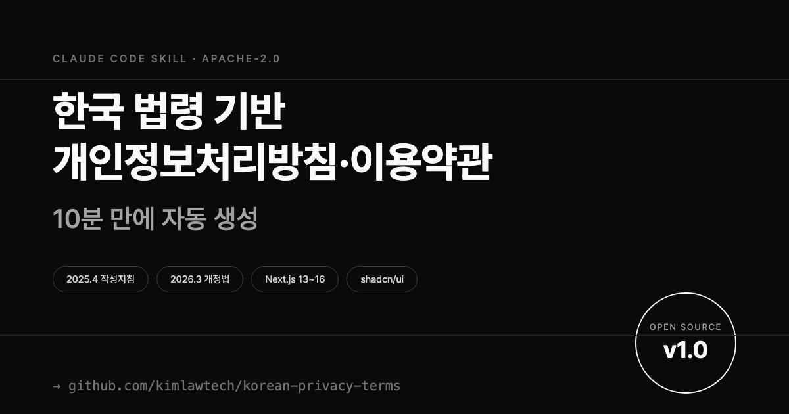

# korean-privacy-terms



[](https://opensource.org/licenses/Apache-2.0)


[](https://discord.gg/hqdGsY7UpH)

한국·일본·EU·미국 법령 기반 개인정보처리방침·이용약관 자동 생성 Claude Code 스킬.
2025.4.21 개인정보 처리방침 작성지침 및 2026.3 개정 개인정보보호법 반영. 일본 APPI(個人情報保護法) v4.1 신규 지원.

> 한국 도메인 특화 AI **스페시아이**에서 만듭니다.
> 법률·세무·노무·회계·의료 실무에 쓰는 도구를 오픈소스로 공개하고,
> 완성 제품은 [speciai.kr](https://speciai.kr) 에서 운영합니다.
> → 제품 [speciai.kr/services](https://speciai.kr/services) · 커뮤니티 [디스코드](https://discord.gg/hqdGsY7UpH)

**라이선스**: Apache-2.0
**버전**: 4.1.0
**저자**: [@kimlawtech](https://github.com/kimlawtech)

## v4.1 하위 스킬 체계

진입점 1개 + 관할별 하위 스킬 5개 구조.

| 스킬 | 호출 | 용도 |
|------|------|------|
| `privacy-terms` | 진입점 | 번호 메뉴로 안내 |
| `privacy-kr` | 직행 | 한국 PIPA 전용 |
| `privacy-eu` | 직행 | EU GDPR 전용 (영문) |
| `privacy-us` | 직행 | 미국 CCPA/CPRA 전용 (영문) |
| `privacy-jp` | 직행 | **일본 APPI 전용 (일본어)** |
| `privacy-global` | 직행 | 한국+EU 병기 |
| `privacy-global-jp` | 직행 | **한국+일본 병기** |

```
/privacy-terms      → 1~6 번호 메뉴 → 해당 스킬 호출 안내
/privacy-kr         → 한국어 인터뷰 직행
/privacy-eu         → 영문 GDPR 인터뷰 직행
/privacy-us         → 영문 CCPA/CPRA 인터뷰 직행
/privacy-jp         → 일본어 APPI 인터뷰 직행
/privacy-global     → 공통+EU 인터뷰로 두 세트 생성
/privacy-global-jp  → 공통+APPI 인터뷰로 한·일 두 세트 생성
```

## 특징

### 🎯 서비스 성격 자동 분기 (v2.1 신규)

첫 3문항만으로 관할법·언어·후속 질문 범위를 자동 결정합니다.

1. 대상 사용자 — 한국만 / 해외 위주 / 글로벌
2. 해외 주력 지역 — EU / US / 아시아 / 전세계
3. 운영 주체 소재지 — 한국 / 해외

→ 이후 Claude가 알아서 한국법·GDPR 중 필요한 질문만 물어봅니다. 평균 10분 이내 완주.

### 🌍 관할법 지원 (v4.1)

- 🇰🇷 **한국 PIPA + 약관규제법 + 전자상거래법**
- 🇪🇺 **EU GDPR + CRD + DSA + ePrivacy**
- 🇺🇸 **미국 CCPA/CPRA + 주요 주법**
- 🇯🇵 **일본 APPI + 消費者契約法 + 特定商取引法** (v4.1 신규)
- 한국+EU / 한국+일본 **병기** 지원
- 🇨🇳 PIPL — 로드맵 (`ROADMAP.md`)

### 🗣 다국어 출력 (v4.1)

- 한국어 전용 / 영문 전용 / 일본어 전용
- 한·영 병기 / 한·일 병기
- ConsentModal·CookieBanner의 `locale` prop으로 런타임 전환 (`ko` | `en` | `ja`)

### 📋 최신 법령 반영

- 개인정보 처리방침 작성지침 2025.4.21 개정
- 개인정보보호법 2026.3.10 공포 (2026.9.11 시행, 과징금 매출 10%)
- 전송요구권 §35조의2 (2025.3.13 시행)
- 자동화된 결정 대응권 §37조의2 (2024.3.15 시행)
- 생성형 AI 개인정보 안내서 (2025.8)
- 공정위 전자상거래 표준약관 제10023호
- 전자상거래법 개정 (2025.12 국회 통과)
- **GDPR 8대 권리 · Art. 6 법적 근거 · Art. 83 과태료 (4%/€20M)**

### 🎨 UI 컴포넌트

- shadcn/ui 기반 **동의 모달** (ko/en 자동 전환)
- **쿠키 동의 배너** (필수·기능·분석·광고 4카테고리, GDPR 옵트인 모드 지원)
- **카카오식 라벨링 카드** 6종
- 처리방침·약관 페이지 템플릿 (Pretendard + 흑백 모노크롬 기본)

### 🔀 서비스 유형별 분기

SaaS · 쇼핑몰 · 커뮤니티 · 블로그 · 핀테크 · AI 서비스 — 유형에 따라 조항 자동 변경

### ✨ 조건부 섹션

14세 미만 · AI 자동화 결정 · 해외사업자 · 맞춤형 광고 · 민감정보 · 전송요구권 — 해당할 때만 섹션 생성

## 설치

### Claude Code

```bash
mkdir -p ~/.claude/skills
cd ~/.claude/skills
git clone https://github.com/kimlawtech/korean-privacy-terms.git
# 하위 스킬 전체 등록
for s in privacy-terms privacy-kr privacy-eu privacy-us privacy-jp privacy-global privacy-global-jp; do
  ln -sf ~/.claude/skills/korean-privacy-terms/skills/$s ~/.claude/skills/$s
done
```

### OpenAI Codex CLI

동일한 SKILL.md 포맷을 쓰므로 경로만 `~/.codex/skills/`로 바꿔 설치:

```bash
mkdir -p ~/.codex/skills
cd ~/.codex/skills
git clone https://github.com/kimlawtech/korean-privacy-terms.git
for s in privacy-terms privacy-kr privacy-eu privacy-us privacy-jp privacy-global privacy-global-jp; do
  cp -RL ~/.codex/skills/korean-privacy-terms/skills/$s ~/.codex/skills/$s
done
```

Codex CLI에서 `/skills` 명령으로 확인하거나 `$privacy-jp` 형태로 멘션해 호출.

### 프로젝트 전용 설치

```bash
mkdir -p /your-project/.claude/skills
cp -r ~/.claude/skills/korean-privacy-terms /your-project/.claude/skills/
```

## 사용법

Claude Code에서:

```
/privacy-terms
```

또는 자연어로:

```
"개인정보처리방침이랑 이용약관 만들어줘"
"쿠키 배너 추가해줘"
"회원가입 동의 모달 설치해줘"
```

### 실제 흐름 예시 (v2.1)

```
[사용자] /privacy-terms

[Claude]
어떤 사용자를 대상으로 하시나요?
1) 한국 사용자만
2) 해외 사용자 위주
3) 양쪽 다 (글로벌)

[사용자] 3번, 글로벌이에요

[Claude]
해외 사용자는 어느 지역에 많나요?
1) 유럽 2) 미국 3) 아시아 4) 전세계

[사용자] 유럽이요

[Claude]
운영 법인은 어디에 있나요?
1) 한국 2) 해외

[사용자] 한국이요

[Claude]
정리하면:
- 한국 본사 + EU 사용자 대상 글로벌 서비스
- 적용 법령: 🇰🇷 PIPA + 🇪🇺 GDPR
- 출력: 한국어 + 영문 병기
- 생성 파일: /privacy, /eu/privacy, /terms, /eu/terms + 컴포넌트
이대로 진행할까요?

[사용자] 네

[Claude] (관할별로 필요한 질문만 추가로 물어봄)
```

## 대상 프로젝트

- **Next.js** 13+ (App Router 권장)
- **Tailwind CSS**
- **shadcn/ui** (자동 설치 지원)
- **MDX** (자동 설치 지원)

## 디렉토리 구조 (v4.1)

```
korean-privacy-terms/
├── SKILL.md                    # 레거시 진입점 (v2.x 호환)
├── ROADMAP.md                  # 장기 확장 계획 (PIPL 등)
│
├── skills/                     # v4.1 하위 스킬 패키지
│   ├── privacy-terms/          # 진입점 스킬 (번호 메뉴 라우팅)
│   ├── privacy-kr/             # 한국 PIPA 전용
│   ├── privacy-eu/             # EU GDPR 전용 (영문)
│   ├── privacy-us/             # 미국 CCPA/CPRA 전용 (영문)
│   ├── privacy-jp/             # 일본 APPI 전용 (일본어) ← v4.1
│   ├── privacy-global/         # 한국+EU 병기
│   └── privacy-global-jp/      # 한국+일본 병기 ← v4.1
│
├── jurisdictions/              # 관할법별 법령·템플릿 (공유 자산)
│   ├── kr-pipa/                # 🇰🇷 한국 PIPA + 약관규제법
│   │   ├── privacy-policy.ko.mdx.tmpl
│   │   ├── privacy-policy.en.mdx.tmpl
│   │   ├── terms-of-service.ko.mdx.tmpl
│   │   └── terms-of-service.en.mdx.tmpl
│   ├── eu-gdpr/                # 🇪🇺 EU GDPR + CRD + DSA
│   │   ├── gdpr-checklist.md
│   │   ├── terms-checklist.md
│   │   ├── privacy-notice.en.mdx.tmpl
│   │   └── terms-of-service.en.mdx.tmpl
│   ├── us-ccpa/                # 🇺🇸 CCPA/CPRA
│   │   ├── ccpa-checklist.md
│   │   └── privacy-policy.en.mdx.tmpl
│   └── jp-appi/                # 🇯🇵 APPI + 消費者契約法 ← v4.1
│       ├── appi-checklist.md
│       ├── privacy-policy.ja.mdx.tmpl
│       └── terms-of-service.ja.mdx.tmpl
│
├── references/                 # 법령 레퍼런스 (한국 10개 + 일본 1개)
│   └── appi-jp.md              # 일본 APPI 법령 체크리스트 ← v4.1
├── assets/components/          # React 컴포넌트 원본
├── assets/config/              # next.config, mdx-components 템플릿
├── scripts/                    # interview, render, install 절차
└── examples/                   # 입출력 페어
```

## 법적 면책

본 스킬이 생성하는 문서는 **참고용 초안**이며, 법률 자문이 아닙니다.

- 실서비스 배포 전 **변호사 검토 필수**
- 개인정보처리방침 미공개 시 **과태료 5,000만원 이하**
- 중대한 위반 시 **과징금 매출액 10%** (2026.9.11 시행)
- 표준약관 마크 부정사용 시 **5,000만원 이하**

## 기여

Pull Request 환영합니다. 특히:

- 추가 서비스 유형 템플릿 (에듀테크, 헬스케어 등)
- 다국어 대응 (영문 처리방침)
- Vue·Svelte 컴포넌트 포팅
- 최신 법령 반영 업데이트

## 참고 자료

**한국**
- [개인정보보호위원회](https://www.pipc.go.kr/)
- [개인정보 처리방침 작성지침 2025.4](https://www.privacy.go.kr/)
- [공정거래위원회 표준약관](https://www.ftc.go.kr/www/selectBbsNttList.do?bordCd=201&key=202)
- [국가법령정보센터](https://www.law.go.kr/)

**일본**
- [個人情報保護委員会 (PPC)](https://www.ppc.go.jp/)
- [個人情報保護法ガイドライン](https://www.ppc.go.jp/personalinfo/legal/)
- [消費者庁 特定商取引法](https://www.no-trouble.caa.go.jp/)

## 커뮤니티 — SpeciAI

한국 법률 AI 허브 **SpeciAI** 디스코드에서 만들어요.
들어오면 창업자와 개발자를 위한 모든 AI 법률 소식을 볼 수 있다!
신규 스킬 업뎃 소식 등 공지도 한다!

계약서 검토, 노동·투자·지재권 법률 이슈를 AI와 함께 풀어가는 **창업자·변호사 커뮤니티**입니다. 
스킬 제안·버그 리포트·질문 모두 환영합니다.

**초대 링크**: [discord.gg/hqdGsY7UpH](https://discord.gg/hqdGsY7UpH)

운영: [@kimlawtech](https://github.com/kimlawtech)

## License

**Apache License 2.0** — 자세한 내용은 [LICENSE](./LICENSE) 참조.
Copyright 2026 kimlawtech (SpeciAI).

## Disclaimer

본 스킬이 생성하는 문서는 **참고용 초안**이며 법률 자문이 아닙니다. 실서비스 배포 전 반드시 변호사 검토를 받으세요.
자세한 면책 고지는 [DISCLAIMER.md](./DISCLAIMER.md) 참조.

---

Built with [Claude Code](https://claude.com/claude-code) by [@kimlawtech](https://github.com/kimlawtech).

---

## 만든 곳

[스페시아이](https://speciai.kr)는 법률·세무·노무·회계·의료 실무에 쓰는
도메인 특화 AI를 만듭니다. 한국능률협회와 AI 교육과정을 공동 개설했고,
전문직 세미나에 누적 500명 이상이 참여했습니다.

- 제품 전체 — <https://speciai.kr/services>
- Claude Code 플러그인 (법무·노무·세무 자문) — <https://speciai.kr/plugin>
- 전문직 AI 세미나 (월 1회) — <https://speciai.kr/seminar>
- 커뮤니티 — <https://discord.gg/hqdGsY7UpH>

### 함께 만든 오픈소스

| 저장소 | 내용 | |
|---|---|---|
| [korean-jangbu-for](https://github.com/kimlawtech/korean-jangbu-for) | 장부 자동 생성·OCR | 80★ |
| [korean-contracts](https://github.com/kimlawtech/korean-contracts) | 한국 계약서 9종 | 61★ |
| [korean-patent-diagram](https://github.com/kimlawtech/korean-patent-diagram) | 특허 도면 자동 생성 (KIPO 규격) | 18★ |
| [korean-certified-mail](https://github.com/kimlawtech/korean-certified-mail) | 내용증명 14종 | 9★ |
| [korean-domain-agent](https://github.com/kimlawtech/korean-domain-agent) | 도메인 특화 LLM 에이전트 킷 | 5★ |
